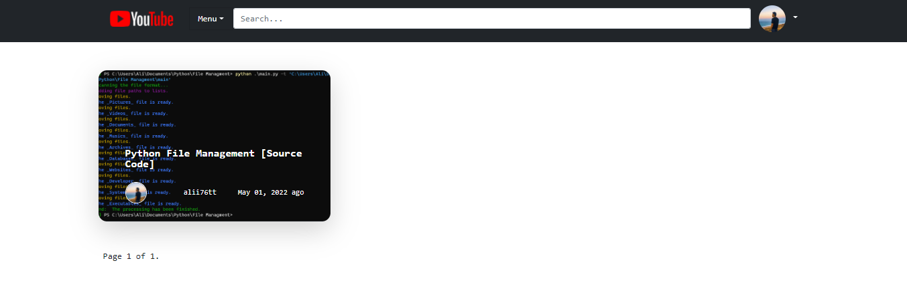

<h1 align='center'>YouTube Clone In Django</h1>
<p align='center'>Basic YouTube clone website built in django web framework using Python.</p>

## Live Demo
<p align='center'><a target="_blank" href="https://youtubeclonee.pythonanywhere.com"></a></p>

<p align="center">
    <a href="https://youtubeclonee.pythonanywhere.com">
        
    </a>
</p>

## Properties

```
Create User, Video, Comment-Reply, Channel, Watch Later List
Share Video and Channel
```

## Requirements
You can install the Requirements by running the command:

```
pip install -r requirements.txt
```

```
asgiref==3.5.0
autopep8==1.6.0
Django==4.0.3
django-ckeditor==6.2.0
django-js-asset==2.0.0
Pillow==9.0.1
pycodestyle==2.8.0
sqlparse==0.4.2
toml==0.10.2
tzdata==2021.5
```

## Installation
```sh
$ git clone https://github.com/alii76tt/django-youtube-clone
$ cd django-youtube-clone
$ python -m venv venv
if you are using windows:
$.\venv\Scripts\activate
if you are using linux
$source venv/bin/activate
$ pip install -r requirements.txt
$ python manage.py runserver
```

## Screenshots
<p align='center'>
     
    
    
        
</p>
